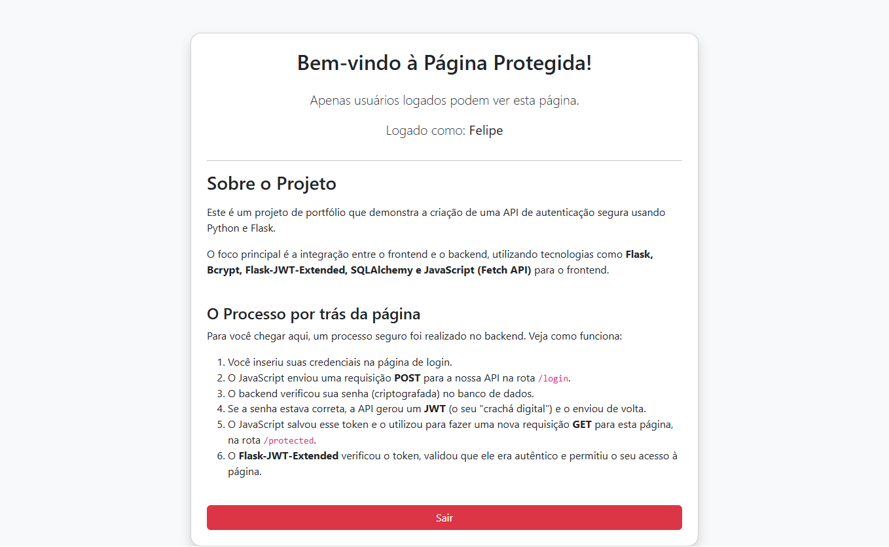
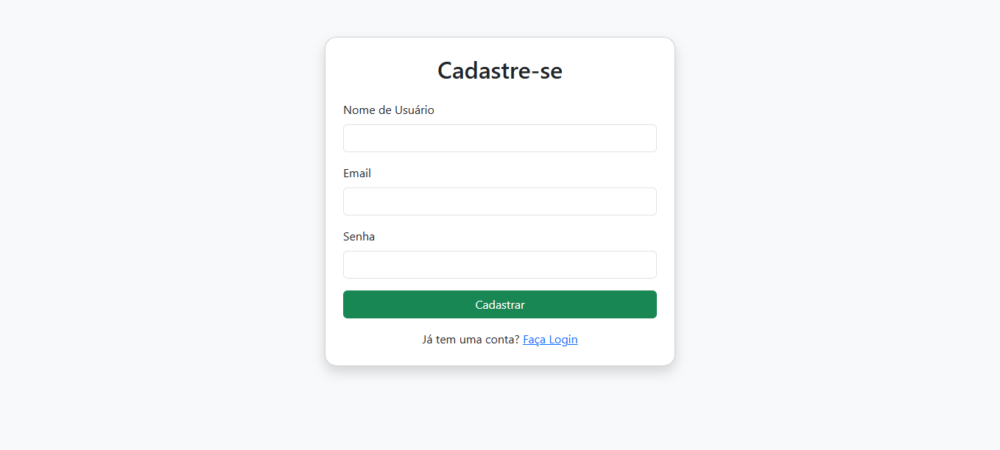
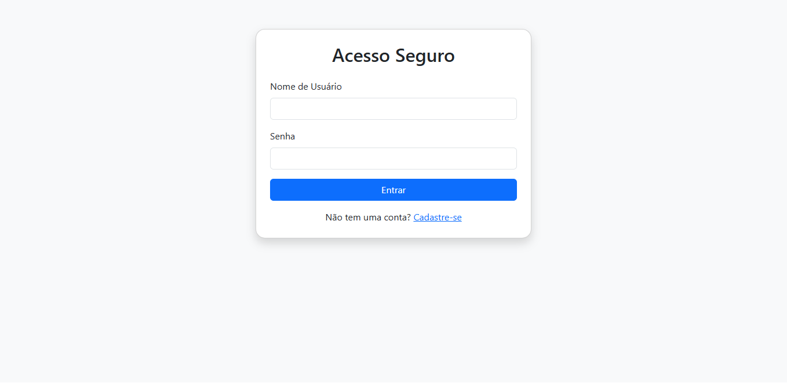

# 🔐 FLASK_JWT_API

## ✨ Sobre o Projeto

Este é um projeto de portfólio que demonstra a implementação de uma API de autenticação completa e segura utilizando Python e o framework Flask. O foco principal é a integração entre um backend robusto e um frontend simples, mas funcional, para gerenciar o registro e o login de usuários com segurança.

### 🖼️ Demonstração

Veja abaixo as telas principais da aplicação em ação.

<p align="center">
  
  <br>
  <i>Página de Dashboard, acessível apenas com autenticação.</i>
</p>

<p align="center">
  
  
  <br>
  <i>Telas de Registro e Login, que gerenciam a autenticação.</i>
</p>

## 🔑 Tecnologias Utilizadas

- **Backend:** `Python`, `Flask`, `Flask-JWT-Extended`, `SQLAlchemy` e `Bcrypt`.

- **Frontend:** `HTML5`, `CSS3 (com Bootstrap)` e `JavaScript (ES6)`.

- **Banco de Dados:** `SQLite`.

### 💡 Funcionalidades do Projeto

Este projeto foi desenvolvido com foco em demonstrar um fluxo de autenticação e autorização completo, cobrindo tanto o backend quanto o frontend. As principais funcionalidades incluem:

-   **🔐 Autenticação Segura de Usuário**: O sistema permite o cadastro de novos usuários, com senhas criptografadas usando **Bcrypt** para garantir que as credenciais nunca sejam armazenadas em texto simples.

-   **🔑 Geração de JWT (JSON Web Token)**: Após o login, o backend gera um token de acesso que atua como uma "identidade digital". Este token é usado para autorizar requisições subsequentes.

-   **🛡️ Rotas Protegidas por JWT**: A API possui endpoints que só podem ser acessados com um JWT válido. Isso garante que apenas usuários autenticados possam acessar dados e funcionalidades restritas.

-   **🖥️ Gerenciamento de Estado no Frontend**: O token de acesso é armazenado no `localStorage` do navegador. O JavaScript da aplicação é responsável por incluir este token nas requisições para as rotas protegidas.

-   **🚫 Proteção de Páginas**: O projeto implementa uma verificação de token no frontend que impede que usuários não autenticados vejam o conteúdo da página protegida, redirecionando-os para o login de forma imediata.

-   **🚪 Funcionalidade de Logout**: O usuário pode facilmente fazer logout, o que remove o token do armazenamento local e encerra a sessão.

-   **📊 Estrutura de Código Organizada**: O código é modular, com separação clara entre as rotas da API, os modelos de dados e a lógica de serviço, facilitando a manutenção e a escalabilidade.

## 🚀 Como Executar o Projeto

### Siga estes passos para configurar e rodar a aplicação em sua máquina local.

#### 📋 Pré-requisitos

> Certifique-se de ter o Python 3.8+ e o pip instalados.

#### ⚙️ Instalação e Configuração

**Clone o repositório:**

```
git clone https://github.com/seu-usuario/FLASK_JWT_API.git
cd FLASK_JWT_API
```

**Crie e ative um ambiente virtual:**

**Windows:**

```
python -m venv venv
.\venv\Scripts\activate
```

**macOS/Linux:**

```
python3 -m venv venv
source venv/bin/activate
```

**Instale as dependências:**

```
pip install -r requirements.txt
```

**Inicialize o banco de dados:**

>**Flask shell**
```
>>> from app import db
>>> db.create_all()
>>> exit()
```
*(Este comando irá criar o arquivo `site.db` dentro da pasta instance.)*

**Defina a chave secreta do JWT:**

`JWT_SECRET_KEY='sua_chave_secreta_segura_aqui'`

*(Atenção: Mantenha esta chave secreta e única.)*

### ▶️ Rodando a Aplicação
Para iniciar o servidor, execute o arquivo run.py:

```
python run.py
```
O servidor estará rodando em http://127.0.0.1:5000/.

### 🌐 Endpoints da API

A aplicação expõe os seguintes endpoints:

| URL          | Método | Descrição                             | Autenticação |
|--------------|--------|---------------------------------------|--------------|
| `/`          | `GET`  | Rota para a página de registro.       | Pública      |
| `/login`     | `GET`  | Rota para a página de login.          | Pública      |
| `/dashboard` | `GET`  | Rota para a página de dashboard.      | Pública      |
| `/register`  | `POST` | Cria um novo usuário.                 | Pública      |
| `/login`     | `POST` | Autentica o usuário e retorna um JWT. | Pública      |
| `/protected` | `GET`  | Retorna dados do usuário logado.      | **Protegida**|
<br>

## 👨‍💻 Autor

- **Felipe Oliveira** - [Code-Lipe](https://github.com/Code-Lipe)

---

## 📄 Licença

Este projeto está licenciado sob a **Licença MIT**.

A Licença MIT é uma licença de software de código aberto permissiva que permite a reutilização e redistribuição do software, tanto em projetos de código aberto quanto em projetos proprietários, desde que a licença original e o aviso de direitos autorais sejam incluídos.

